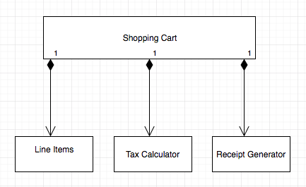

## About

This is a program that prints out a receipt which has the following details related to a purchase:

* Items purchased and their related cost(including applicable taxes if any)
* Total sales tax collected
* Total costs incurred related to the overall purchase.

## Code related design decisions

* The entities related to the problem domain are - Line Item, Receipt, Shopping Cart and  Tax
* A shopping cart has - line items, a tax calculator and a receipt generator. They satisfy the **"has_a"** relationship hence I've **made use of composition** in appropriate places.



* Have made use of `BigDecimal` class in Ruby to represent money related values in a more accurate manner

* Items that are exempt from basic sales tax(st) are specified as part of the `TaxCalculator` class
  * Items are categorized as food, medical products and books based on certain keywords in the item names. Those keywords that'll help check if an item is exempt from sales tax are also specified  as part of the `TaxCalculator` class

* Imported items are those that have the word `imported` in them.

* With **Single Responsiblity Principle** in mind the responsibility of each class is:
  * A `CsvParser` class that is used to read the input from a CSV file and remove all unnecessary leading and trailing whitespaces
  * A `LineItem` class that is used to contain the different properties related to each line item.
  * A `TaxCalculator` class that calculates
    * The price of an item inclusive of tax
    * The total sales tax per item
  * A `ReceiptGenerator` class that is mainly used to generate a receipt
  * A `ShoppingCart` class that is used to facilitate the purchase/checkout process


### Assumptions
* The program accepts Comma Separated Values(CSV) as input. Hence I've made use of a `CsvParser` to read CSV data.
* The CSV files are to be placed in the `input` directory inorder to be read by the program
* Price is a positive number
* Product quantity is a positive integer.

## Usage

### Dependencies
* Ruby 2.5
* Please refer to the Gemfile for the other dependencies

### Setup
* Run `bundle install` from a project's root directory to install the related dependencies.

### Running the program
One can run the program with the below command from the projects root directory.

*Format:*

`ruby bin/generate_sales_receipt.rb path_to_csv_file_name_present_in_input_directory.csv`

*Example:*

`ruby bin/generate_sales_receipt.rb shopping_basket3.csv`

### Running the tests
* One can run the specs from the project's root directory with the command `rspec`

### Program Output

* Below is a sample program output run against the command `ruby bin/generate_sales_receipt.rb shopping_basket3.csv`

```
1, imported bottle of perfume, 32.19
1, bottle of perfume, 20.89
1, packet of headache pills, 9.75
1, imported box of chocolates, 11.85

Sales Taxes: 6.7
Total: 74.68
```